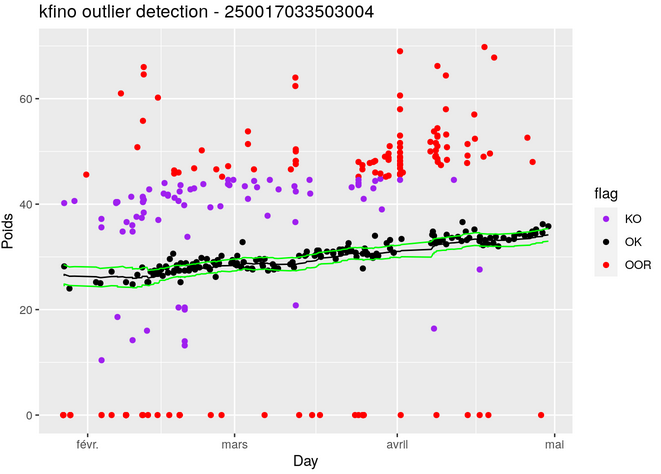
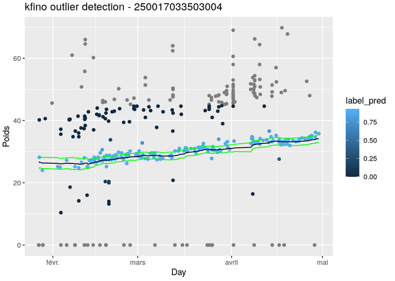
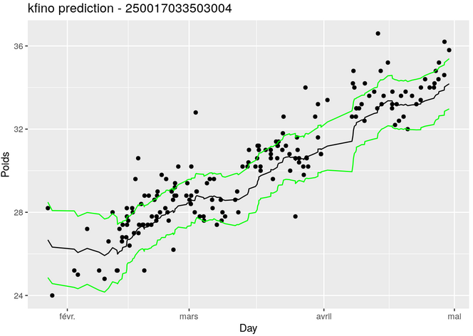

[](https://forgemia.inra.fr/isabelle.sanchez/kfino/-/commits/main) 

# kfino 

The **kfino** algorithm was developped for time courses in order to detect impulse noised outliers and predict the parameter of interest mainly for data recorded on the walk-over-weighing system described in this publication:

E.González-García *et. al.* (2018) A mobile and automated walk-over-weighing system for a close and remote monitoring of liveweight in sheep. vol 153: 226-238. https://doi.org/10.1016/j.compag.2018.08.022

**Kalman filter with impulse noised outliers** (kfino) is a robust sequential algorithm allowing to filter data with a large number of outliers. This algorithm is based on simple latent linear Gaussian processes as in the Kalman Filter method and is devoted to detect impulse-noised outliers. These are data points that differ significantly from other observations.

The method is described in full details in the following arxiv preprint: https://arxiv.org/abs/2208.00961.

## Installation

To install the **kfino** package, the easiest is to install it directly from GitLab. Open an R session and run the following commands:

```
if (!require("remotes")) {
  install.packages("remotes")
}
remotes::install_gitlab("isabelle.sanchez/kfino",host = "forgemia.inra.fr",
                        build_vignettes=TRUE)
```
                        
## Usage
Once the package is installed on your computer, it can be loaded into a R session:

```
library(kfino)
help(package="kfino")
```

Please, have a look to the vignettes that explain how to use the algorithm. The 
main specifications are:

* filtering data with a large number of outliers 
* predicting the analyzed variable
* providing useful graphics to interpret the data







## Citation
As a lot of time and effort were spent in creating the kfino algorithm, please cite it when using it for data analysis:

https://arxiv.org/abs/2208.00961.

See also citation() for citing R itself.

## References

The **kfino** logo was created using the **hexSticker** package:

* Guangchuang Yu (2020). hexSticker: Create Hexagon Sticker in R. R package version 0.4.9. https://CRAN.R-project.org/package=hexSticker

Walk-over-weighing system:

* E.González-García *et. al.* (2018) A mobile and automated walk-over-weighing system for a close and remote monitoring of liveweight in sheep. vol 153: 226-238. https://doi.org/10.1016/j.compag.2018.08.022
* González García, Eliel, 2021, Individual liveweight of Mérinos d'Arles ewelambs, measured with a Walk-over-Weighing (WoW) system under Mediterranean grazing conditions, https://doi.org/10.15454/IXSHF7, Recherche Data Gouv, V5, UNF:6:q4HEDt0n8nzxYRxc+9KK8g==[fileUNF] 
